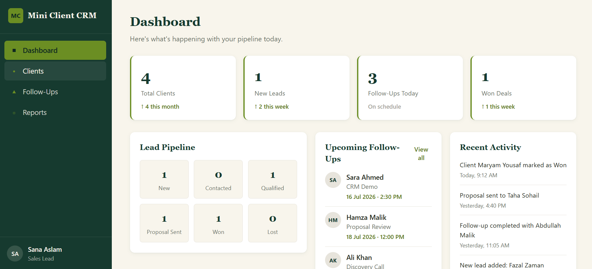
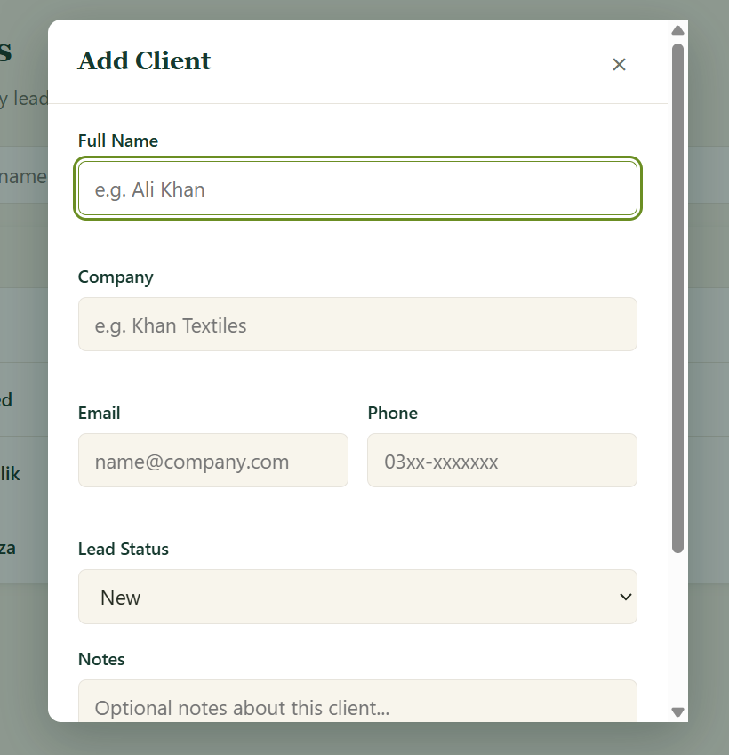
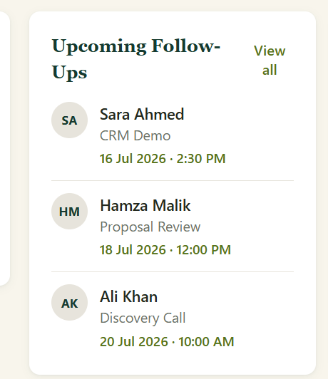

# Mini Client CRM

## Project Overview

### Project Title
Mini Client CRM

### Project Description
Mini Client CRM is a lightweight Customer Relationship Management (CRM) application that helps users manage clients and their follow-up activities. The system provides an easy way to store client information, track interactions, organize follow-up tasks, and monitor client progress through an intuitive dashboard.

### Project Idea
The objective of this project is to provide businesses with a simple CRM system that centralizes client information and follow-up scheduling. Instead of manually tracking customer interactions, users can efficiently manage clients, monitor sales progress, and stay updated on pending follow-ups through a single application.

---

# Team Members

| Team Member | Role |
|-------------|------|
| Zainab | Team Lead / Project Manager |
| Maryum | Frontend Developer |
| Taha Sohail | Backend Developer |
| Hassaan | Database Engineer |
| Abiha | QA & Documentation |

---

# Features

## Completed Features

- [x] Add Client
- [x] View Clients
- [x] Edit Client
- [x] Delete Client
- [x] Search Clients
- [x] Sort Clients
- [x] Add Follow-Up
- [x] Edit Follow-Up
- [x] Delete Follow-Up
- [x] Dashboard with live statistics
- [x] SQLite Database Integration
- [x] Reports Section

## Bonus Features

- Reports dashboard with client insights
- Follow-Up Management module
- Client sorting functionality
- Responsive user interface

---

# Technology Stack

### Frontend
- HTML5
- CSS3
- JavaScript (Vanilla)

### Backend
- Node.js
- Express.js

### Database
- SQLite

### Version Control
- Git
- GitHub

---

# Screenshots


## Dashboard



---


## Add Client



---


## Follow-Up Management



---

## Reports


---

# Database Schema

## Database Tables

### Clients

The **Clients** table stores all client information including their personal details, company information, contact details, lead status, notes, and the date the client was added to the system.

Fields include:

- Client ID
- Full Name
- Company
- Email
- Phone Number
- Lead Status
- Notes
- Created Date

### FollowUps

The **FollowUps** table stores scheduled follow-up activities for each client.

Fields include:

- Follow-Up ID
- Client ID
- Follow-Up Date
- Follow-Up Time
- Purpose
- Status
- Remarks
- Created Date

### Relationships

The **FollowUps** table is linked to the **Clients** table through the `Client ID` foreign key. Each follow-up belongs to a specific client. Cascade deletion is enabled so that deleting a client automatically removes all associated follow-up records.

---

# Database Setup

The application uses SQLite as its database management system.

When the backend server starts, the database is automatically initialized. If the database does not exist, the required tables are created and sample data is inserted using the provided schema and seed files.

---

# Installation

1. Clone the repository.

```bash
git clone <repository-url>
```

2. Navigate to the project folder.

```bash
cd mini-client-crm
```

3. Navigate to the server directory.

```bash
cd server
```

4. Install all required dependencies.

```bash
npm install
```

---

# Running the Project

### Start the Backend

```bash
npm start
```

or during development

```bash
npm run dev
```

### Launch the Frontend

Open the frontend using Live Server or any local web server, then access the application through your browser.

---

# GitHub Workflow

## Development Process

1. Create a GitHub Issue.
2. Create a feature branch.
3. Implement the assigned feature.
4. Commit changes with meaningful commit messages.
5. Push the branch to GitHub.
6. Open a Pull Request.
7. Request code review.
8. Merge into the main branch after approval.

---

## Example Issue

**Issue:** Create Client CRUD

**Description:**
asks:

-Add client
-View client list
-Update client information
-Delete client
-Validate form inputs

---

## Example Pull Request

**Title:** feat: complete frontend UI closes issue 2

**Description:**
implemented the complete frontend interface for Mini Client CRM.

-Features Included
-Dashboard with KPI cards and lead pipeline
-Client Management interface
-Add/Edit/Delete client functionality
-Client search and status filtering
-Follow-Up Management interface
-Add/Edit/Delete follow-ups
-Dynamic dashboard statistics
-Reports section with summaries and insights
-Responsive layout for desktop, tablet, and mobile
-Status badges and validation messages
-Modal-based forms and confirmations

# Folder Structure

```text
mini-client-crm/
│
├── client/
│   ├── .gitkeep
│   ├── script.js
│   ├── style.css
│   └── index.html
│
├── server/
│   ├── routes/
│   ├── controllers/
│   ├── middleware/
│   ├── package.json
│   └── index.js
│
├── database/
│   ├── crm.db
│   ├── schema.sql
│   ├── seed.sql
│   └── db.js
│
├── docs/
│   └── screenshots/
│
├── README.md
└── TESTING.md
```

---

# Known Limitations

- Reports provide basic summaries only.
- Email reminders and notifications are not supported.
- Data export functionality is not available.

---

# Future Improvements

Potential enhancements include:

- User authentication and authorization
- Role-based access control
- Email reminders for follow-ups
- Data export (CSV/PDF)
- Advanced reporting and analytics
- Calendar integration
- File attachments for clients
- Improved dashboard visualizations

---

# Testing

Comprehensive testing procedures, QA checklist, test cases, and testing evidence are available in:

```
TESTING.md
```

The application was manually tested to verify:

- Client CRUD operations
- Follow-Up CRUD operations
- Dashboard updates
- Search and sorting functionality
- SQLite database integration
- Responsive user interface

# License

This project was developed for academic purposes as part of a Software Engineering Internship at Codoc. It is intended for educational use only and is not licensed for commercial distribution.
