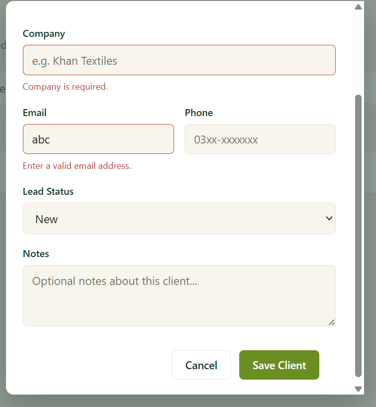
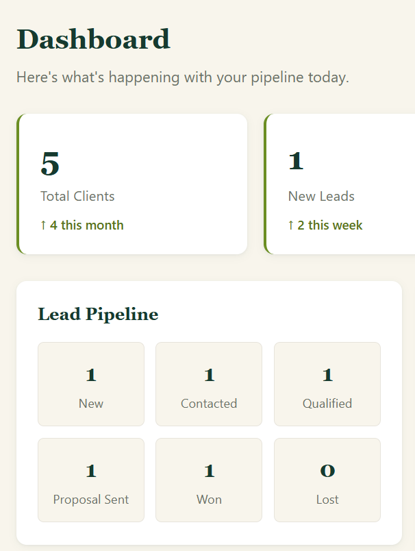
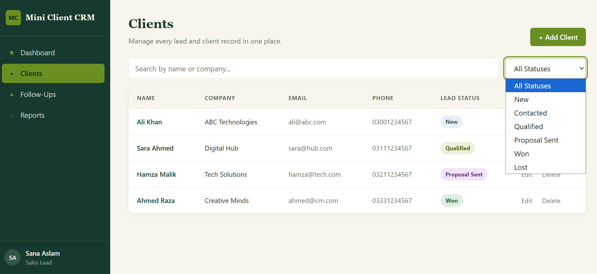
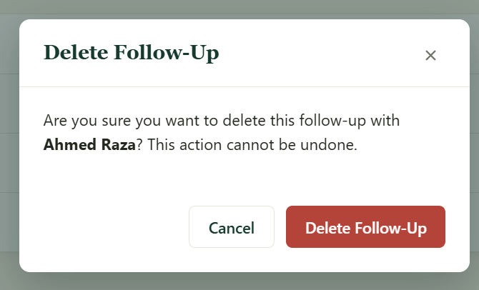
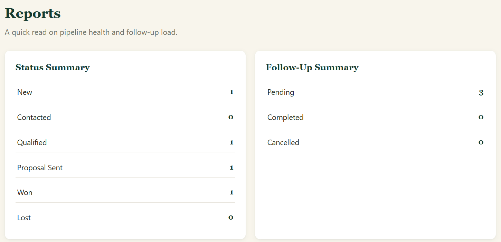

# Testing Report

## Project
**Mini Client CRM**

## Tester
**Abiha Jibbran**

---

# Overview

This document records the manual testing performed for the Mini Client CRM application. The objective was to verify that the implemented features function correctly, validate user input, and ensure the frontend and backend interact with the SQLite database as expected.

---

# Testing Environment

| Component | Details |
|----------|---------|
| Operating System | Windows |
| Backend | Node.js + Express |
| Database | SQLite |
| Frontend | HTML, CSS, JavaScript |

---

# QA Checklist

## Application Setup

- [x] Frontend loads successfully
- [x] Backend starts successfully
- [x] SQLite database connects successfully

## Client Management

- [x] Add Client
- [x] Edit Client
- [x] Delete Client
- [x] Search Clients
- [x] Sort Clients

## Follow-Up Management

- [x] Add Follow-Up
- [x] Edit Follow-Up
- [x] Delete Follow-Up

## Dashboard

- [x] Dashboard statistics update correctly
- [x] Client metrics display correctly

## Validation

- [x] Required fields validated
- [x] Invalid data prevented
- [x] Validation messages displayed

## User Interface

- [x] Navigation works correctly
- [x] Responsive layout verified

---

# Test Cases

## Test Case 1 – Client Form Validation

**Objective**

Verify that invalid client information cannot be submitted.

**Expected Result**

Validation messages are displayed and invalid submissions are prevented.

**Actual Result**

Validation messages were displayed correctly and invalid submissions were blocked.

**Status**

✅ Passed

### Evidence

---

## Test Case 2 – Dashboard Statistics

**Objective**

Verify that dashboard metrics update after client operations.

**Expected Result**

Dashboard statistics refresh automatically when client data changes.

**Actual Result**

Dashboard updated correctly after data changes.

**Status**

✅ Passed

### Evidence

---

## Test Case 3 – Client Sorting

**Objective**

Verify that clients can be sorted correctly.

**Expected Result**

Clients are displayed according to the selected sorting option.

**Actual Result**

Sorting function worked as expected.

**Status**

✅ Passed

### Evidence

---

## Test Case 4 – Delete Follow-Up

**Objective**

Verify that follow-ups can be removed successfully.

**Expected Result**

Selected follow-up is deleted and removed from the list.

**Actual Result**

Follow-up was deleted successfully.

**Status**

✅ Passed

### Evidence

---

## Test Case 5 – Reports

**Objective**

Verify that reports reflect the latest client and follow-up data.

**Expected Result**

Reports update dynamically after changes.

**Actual Result**

Report statistics updated correctly.

**Status**

✅ Passed

### Evidence

---

## Test Case 6 – Edit Follow-Up

**Objective**

Verify that follow-up information can be edited.

**Expected Result**

Changes are saved and displayed correctly.

**Actual Result**

Follow-up details updated successfully.

**Status**

✅ Passed

### Evidence

---

# Bugs Identified

No critical bugs were identified during final testing.

Any issues discovered during development were documented through GitHub Issues and resolved prior to final review.

---

# Final Verification

| Item | Status |
|------|--------|
| Frontend functions correctly | ✅ |
| Backend functions correctly | ✅ |
| Database operations successful | ✅ |
| Client CRUD operations verified | ✅ |
| Follow-Up CRUD operations verified | ✅ |
| Dashboard updates correctly | ✅ |
| Reports generate correctly | ✅ |
| Input validation functions correctly | ✅ |
| Responsive layout verified | ✅ |
| Project ready for submission | ✅ |

---

# Conclusion

Manual testing confirmed that the core functionality of the Mini Client CRM application operates as intended. Client management, follow-up management, dashboard updates, reporting, sorting, and validation behaved according to the project requirements. The application was reviewed for functionality, usability, and data consistency, and no critical issues remained at the time of final verification.
